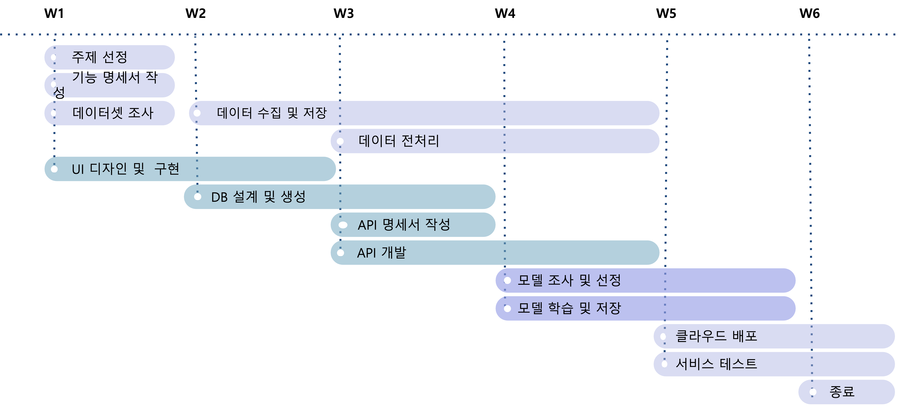
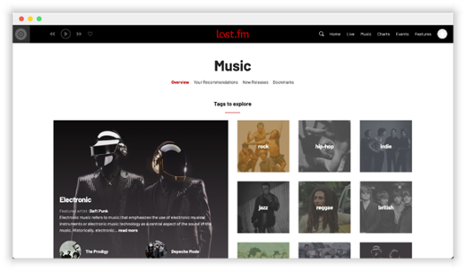

# 💁 🎶  사용자 취향 분석 기반 음악 추천 및 친구 추천

        

&nbsp;
&nbsp;

## 2️⃣ RecSys_2조 2️⃣

## 🙋🏻‍♂️🙋🏻‍♀️  Member
<table align="center">
  <tr height="155px">
    <td align="center" width="150px">
      
    </td>
    <td align="center" width="150px">
      
    </td>
    <td align="center" width="150px">
      
    </td>
    <td align="center" width="150px">
      
    </td>
    <td align="center" width="150px">
      
    </td>
  </tr>
  <tr height="80px">
    <td align="center" width="150px">
      <a href="https://github.com/ktasha45">김동영_4028</a>
    </td>
    <td align="center" width="150px">
      <a href="https://github.com/NIckmin96">민복기_T4074</a>
    </td>
    <td align="center" width="150px">
      <a href="https://github.com/parkkyungjun">박경준_T4076</a>
    </td>
    <td align="center" width="150px">
      <a href="https://github.com/HeeJeongOh">오희정_T4129</a>
    </td>
    <td align="center" width="150px">
      <a href="https://github.com/yhw991228">용희원_T4130</a>
    </td>
  </tr>
</table>
&nbsp;

## 🎶  Project Overview
이 서비스는 사용자에게 새로운 친구와 새로운 음악 모두에 대한 추천을 제공함으로써 두 세계의 장점을 결합한다. 이용자의 음악 선호도와 듣는 습관을 분석해 음악 취향이 비슷한 사람들과 매칭하는 서비스다.

또한, 이 서비스는 사용자가 좋아하는 아티스트, 노래, 장르를 기반으로 개인화된 음악 추천도 제공한다. 권장 사항은 사용자가 항상 원하는 스타일의 최신 음악에 액세스할 수 있도록 정기적으로 업데이트됩니다.

이 서비스를 통해, 사용자들은 새로운 음악을 발견하고, 새로운 친구를 사귀고, 음악에 대한 열정을 공유하는 다른 사람들과 연결할 수 있다. 당신이 노련한 음악 애호가든, 이제 막 소리의 세계를 탐험하기 시작하든, 이 서비스는 모든 사람들을 위한 무언가를 가지고 있다.
--> 수정 부탁드려용

## Project Plan

&nbsp;
## MusicOops

## ✅ Recommand List

## 🚨 System Architecture

## 📀 Dataset
&nbsp; 
### LFM-1b dataset

[//]: # ()
[//]: # (![lastfmapi2.png]&#40;img/lastfmapi2.png&#41;)

[//]: # ()
[//]: # (![lastfmapi1.png]&#40;img/lastfmapi1.png&#41;)

## Model : S3Rec

[출처 : https://recbole.io/docs/user_guide/model/sequential/s3rec.html]

[//]: # (## DB : Postgresql)

