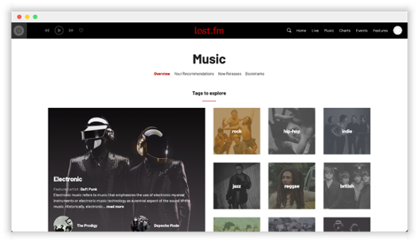
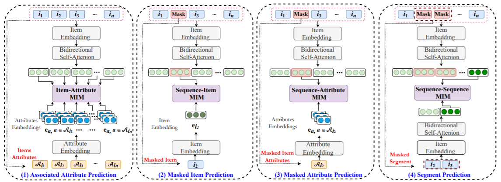

# 💁 🎶  사용자 취향 분석 기반 음악 추천 및 친구 추천

<a align = "center"></a>

        

&nbsp;
&nbsp;

### 2️⃣ RecSys_2조 2️⃣

### 🙋🏻‍♂️🙋🏻‍♀️  Member
<table align="center">
  <tr height="155px">
    <td align="center" width="150px">
      <a href="https://github.com/ktasha45"></a>
    </td>
    <td align="center" width="150px">
      <a href="https://github.com/NIckmin96"></a>
    </td>
    <td align="center" width="150px">
      <a href="https://github.com/parkkyungjun"></a>
    </td>
    <td align="center" width="150px">
      <a href="https://github.com/HeeJeongOh"></a>
    </td>
    <td align="center" width="150px">
      <a href="https://github.com/yhw991228"></a>
    </td>
  </tr>
  <tr height="80px">
    <td align="center" width="150px">
      <a href="https://github.com/ktasha45">김동영_4028</a>
    </td>
    <td align="center" width="150px">
      <a href="https://github.com/NIckmin96">민복기_T4074</a>
    </td>
    <td align="center" width="150px">
      <a href="https://github.com/parkkyungjun">박경준_T4076</a>
    </td>
    <td align="center" width="150px">
      <a href="https://github.com/HeeJeongOh">오희정_T4129</a>
    </td>
    <td align="center" width="150px">
      <a href="https://github.com/heecircle">용희원_T4130</a>
    </td>
  </tr>
</table>

### 🗂️ Project Structure
```python
.
├── API
│   ├── Dockerfile
│   ├── backend-api.py
│   └── requirements.txt
├── Airflow
│   ├── airflow-webserver.pid
│   ├── airflow.cfg
│   ├── airflow.db
│   ├── dags
│   └── webserver_config.py
├── DB
│   └── README.md
├── EDA
│   ├── EDA_bk.ipynb
│   ├── EDA_final.ipynb
│   ├── README.md
│   └── columns.JPG
├── README.md
├── UI
│   ├── README.md
│   ├── assets
│   ├── lib
│   │   ├── constants.dart
│   │   ├── main.dart
│   │   ├── models
│   │   ├── pages
│   │   ├── utils
│   │   └── widgets
│   ├── pubspec.lock
│   ├── pubspec.yaml
│   └── web
├── bentoml
│   ├── bento
│   └── env
├── crawling
│   ├── README.md
│   ├── artifacts
│   ├── crawling.py
│   ├── multiproceessing_test.py
│   └── requirements.txt
├── model
│   ├── README.md
│   ├── data
│   ├── datasets.py
│   ├── label2string.py
│   ├── models.py
│   ├── modules.py
│   ├── output
│   ├── predictor.py
│   ├── preprocessing_csv.py
│   ├── preprocessing_db.py
│   ├── requirements.txt
│   ├── run_finetune_full.py
│   ├── run_inference.py
│   ├── run_pretrain.py
│   ├── trainers.py
│   └── utils.py
├── lastfm_api_crawl
│   ├── README.md
│   ├── api_key
│   ├── etc
│   ├── lastfm_api_crawl.py
│   └── lastfm_api_crawl.sh
└── img


```

### 🎶  Project Overview
이 서비스는 사용자에게 새로운 친구와 새로운 음악에 대한 추천을 제공함으로써 두 장점을 결합한다. 사용자의 음악 선호도와 패턴을 분석해 음악 취향이 비슷한 사람들을 매칭해주는 서비스이다.

또한, 사용자가 좋아하는 아티스트, 노래, 장르를 기반으로 개인화된 음악 추천 제공한다. 더불어 사용자가 항상 원하는 스타일의 최신 음악에 접근할 수 있도록 정기적으로 업데이트를 진행한다.

이 서비스를 통해, 사용자들은 새로운 음악을 발견하고, 새로운 친구를 사귀고, 음악에 대한 열정을 공유하는 다른 사람들을 만날 수 있다.

### 📆 Project Plan

### 🎧 MusicOops


### ✅ Recommand List


### 🚨 System Architecture


### 📀 Dataset : LFM-1b dataset


[//]: # ()
[//]: # (![lastfmapi2.png]&#40;img/img/lastfmapi2.png&#41;)

[//]: # ()
[//]: # (![lastfmapi1.png]&#40;img/img/lastfmapi1.png&#41;)

### 🧶Model : S3Rec

출처 : https://arxiv.org/abs/2008.07873

### 🧳 DB : Postgresql

