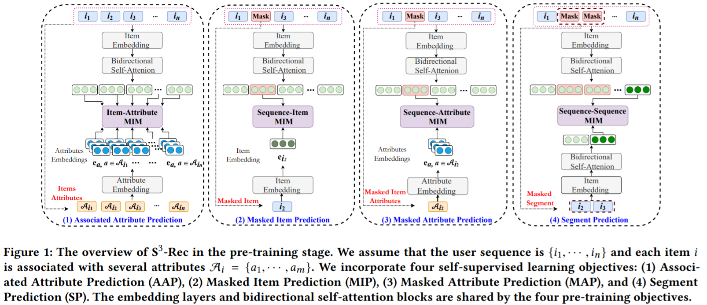

### requirements
```shell script
pip install -r requirements.txt
```

## data format
```shell script
# data preprocess
./model/run_pretrain.py --data_name [data_name]--reprocess_only [true]

# data-name.txt(file format)
one user per line
user_1 item_1 item_2 ...
user_2 item_1 item_2 ...


# data-name_item2attributes.json(file format)
{item_1:[attr, ...], item_2:[attr, ...], ... }
```

## pretrain
```shell script
python run_pretrain.py \
--data_name data_name
```

### pretrain with preprocessing
```shell script
python run_pretrain.py \
--data_name data_name --reprocess [true]
```


## finetune

+ Rank the ground-truth item with all the items
```shell script
python run_finetune_full.py \
--data_name data_name \
--ckp pretrain_epochs_num
```

## inferenece
```shell script
python run_inference.py \
--data_name data_name \
--ckp pretrain_epochs_num
```